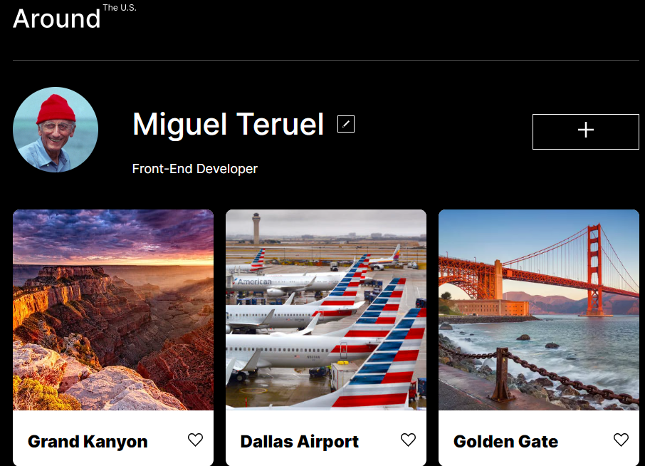

# Projeto 4: EUA Afora

  

### Visão geral
Este projeto foi criado com a finalidade de desenvolvimento de habilidades Front-END, neles são utilizadas algumas das stacks mais utilizadas atualmente no desenvolvimento web, como HTML5, CSS e JavaScript. Além do uso da ferramenta de design Figma. Seu desenvolvimento iniciou-se com o uso do JS puro, passando por uma reestruturação utilizando a POO. Site Responsivo a todo tipo de tela e organizado utilizando a metodologia BEM.
  

* Figma

* [Link para o projeto no Figma](https://www.figma.com/file/XfB6BSINvliub43JgKza1e/WEB.-Sprint-4.-Around-The-U.S.-desktop-%2B-mobile-pt)

Divirta-se com JavaScript!

**Imagens**

  

**Tecnologias Utilizadas**

Neste projeto foram utilizadas as seguintes tecnologias para desenvolvimento:
* HTML 5 
* CSS3 - Flexbox, Position.
* JavaScript
* REACT 

**Link para o projeto**
(https://miguelterueljr.github.io/web_project_4_ptbr)